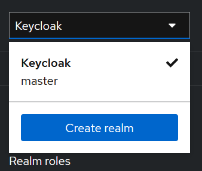
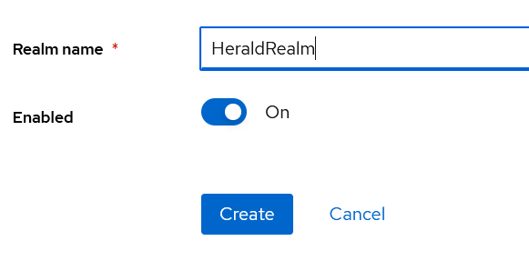

# Prerequisite

This app is entirely run inside a Docker container, which means you will need to install Docker.
This app also uses Keycloak as its user management system.

## Installing & Setting up Docker

You will find everything your need on the [Docker Website](https://docs.docker.com/desktop/)

## Installing Keycloak

Use a volume to store your future app realm and client.
Make sure to remember the port you're binding to, we'll need it for Herald later.
Also make sure to change the admin and admin password when creating the container.

`docker run --name keycloak -p xxxx:8080 -v /path/to/volume:/opt/keycloak/data -e KC_HTTP_ENABLED=true -e KC_HOSTNAME_STRICT=false -e KEYCLOAK_ADMIN=admin -e KEYCLOAK_ADMIN_PASSWORD=admin -d quay.io/keycloak/keycloak:24.0.2 start --import-realm`

## Setting up Keycloak

Open up `http://locahost:xxxx`, xxxx being the port you used in the command above, and sign in using the credentials you used for the admin account.

We're going to create a Realm and a Client, corresponding to our application. To do so, click on the upper left dropdown menu and click "Add Realm".



Create a Realm called "HeraldRealm".



In the navigation bar, click on "Clients" and then click on "Import client".

Copy the following content into a JSON file and use this file to import the client configuration. You will need to change the baseUrl, redirectUris and webOrigins depending on your needs.

```
{
  "clientId": "HeraldClient",
  "name": "Herald",
  "description": "Client for the Herald app",
  "rootUrl": "",
  "adminUrl": "",
  "baseUrl": "https://localhost:5173/",
  "surrogateAuthRequired": false,
  "enabled": true,
  "alwaysDisplayInConsole": false,
  "clientAuthenticatorType": "client-secret",
  "redirectUris": [
    "https://localhost:5173/*"
  ],
  "webOrigins": [
    "https://localhost:5173"
  ],
  "notBefore": 0,
  "bearerOnly": false,
  "consentRequired": false,
  "standardFlowEnabled": true,
  "implicitFlowEnabled": false,
  "directAccessGrantsEnabled": false,
  "serviceAccountsEnabled": false,
  "publicClient": true,
  "frontchannelLogout": true,
  "protocol": "openid-connect",
  "attributes": {
    "oidc.ciba.grant.enabled": "false",
    "oauth2.device.authorization.grant.enabled": "false",
    "backchannel.logout.session.required": "true",
    "backchannel.logout.revoke.offline.tokens": "false"
  },
  "authenticationFlowBindingOverrides": {},
  "fullScopeAllowed": true,
  "nodeReRegistrationTimeout": -1,
  "defaultClientScopes": [
    "web-origins",
    "acr",
    "profile",
    "roles",
    "email"
  ],
  "optionalClientScopes": [
    "address",
    "phone",
    "offline_access",
    "microprofile-jwt"
  ],
  "access": {
    "view": true,
    "configure": true,
    "manage": true
  }
}
```

In the navigation bar, go to "Users" and create your first user. Once done, go to the "Credentials" tab of this user to set their default password.

## Installing Herald

Clone this repository somewhere on your computer.

From the folder, use Docker to build an image of Herald :
`docker build -t herald:latest .`

Then run the Herald image using :

`docker run --name herald -p xxxx:8080 -p yyyy:8081 -d herald:latest`
where xxxx will be the port used to connect to the client and yyyy the port used for the API.

## Note

There is also a Dockerfile in the Herald.Server folder. This Dockerfile is not meant to be used for building the app manually, but for development purposes with Visual Studio.
